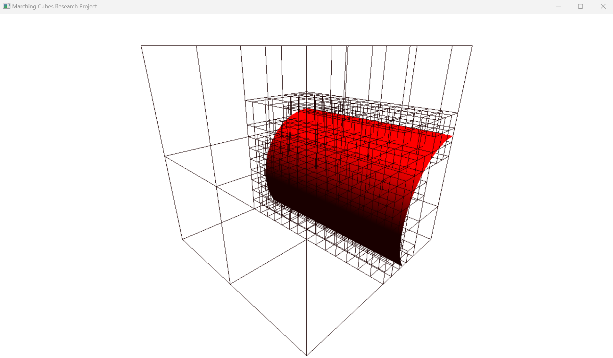
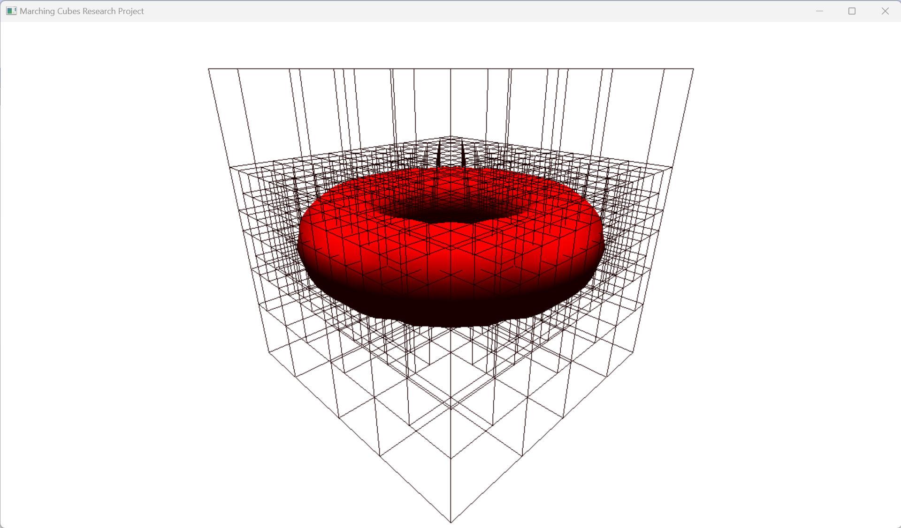
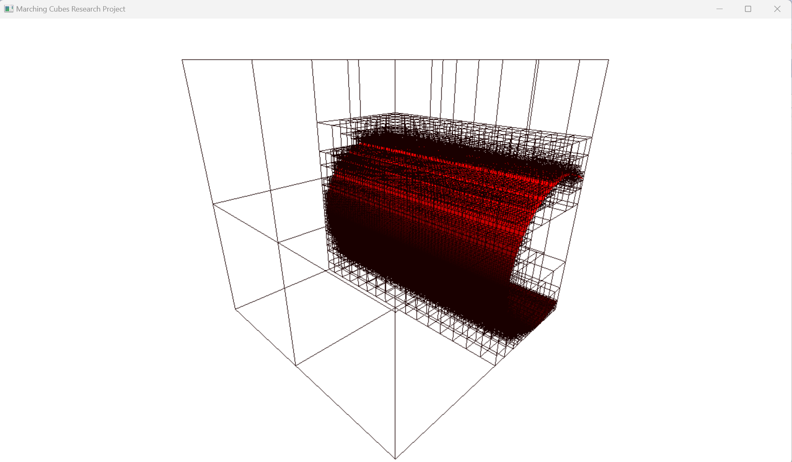
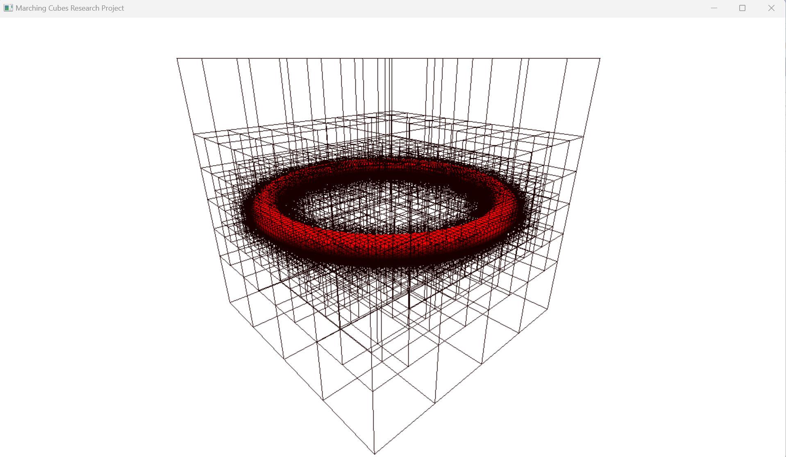
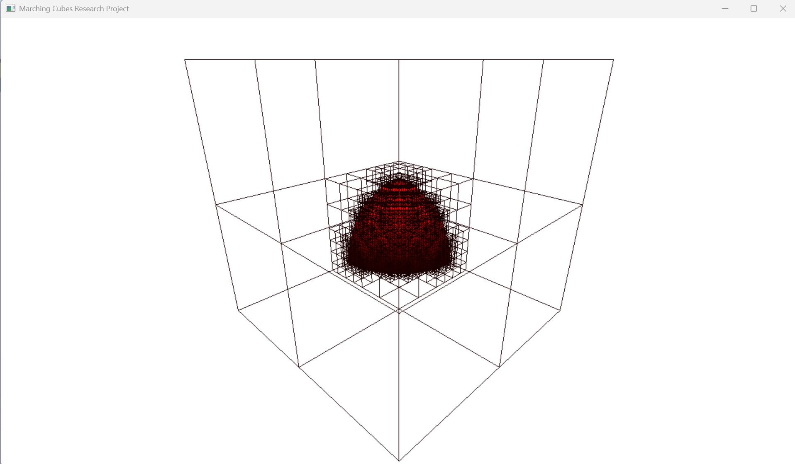
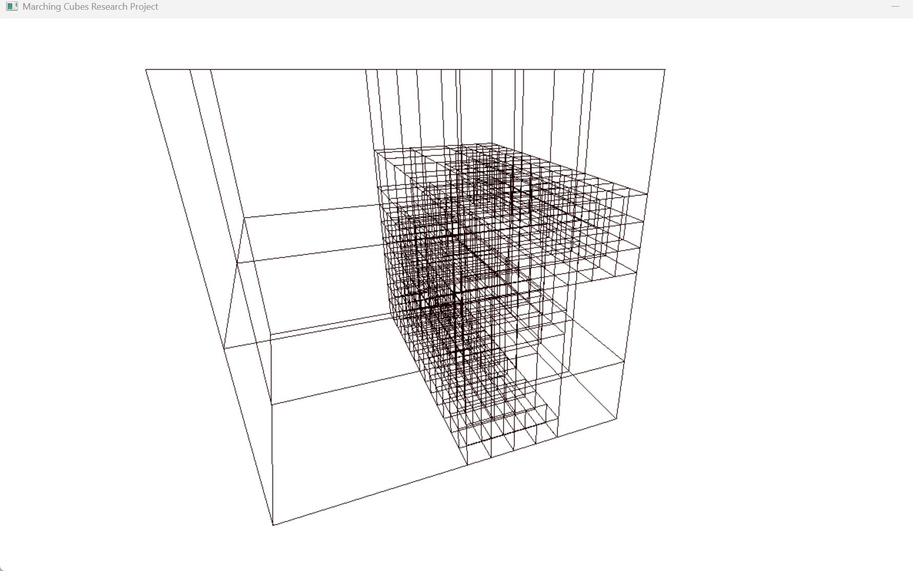
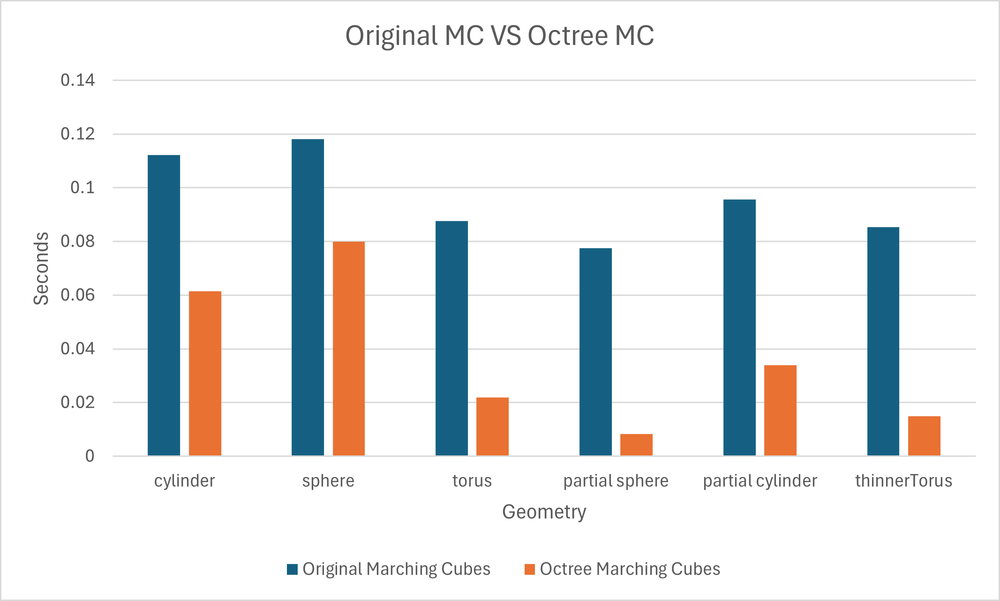
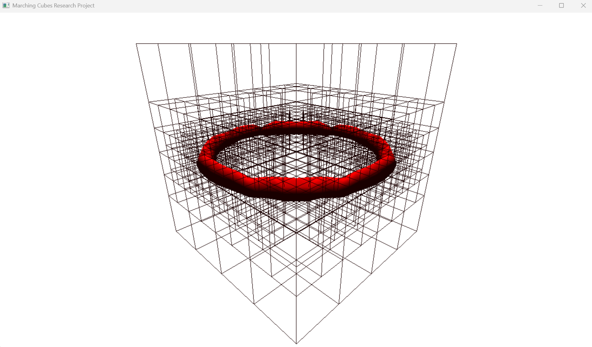
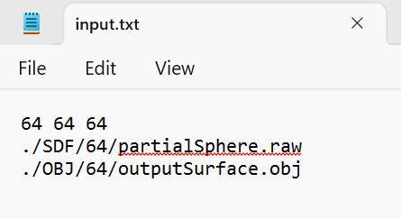

# Marching Cubes with Octree Optimization and Visualization
## Xinjie Zhu's computer graphics and geometry research project (advised by Prof. Oded Stein)

### Project Description
This research project implements the original marching cubes algorithm and octree marching cubes by C++, outputs the obj file of the generated ISO surface based on input SDF values, and visualizes it using modern OpenGL. 

### Marching Cubes Algorithm Description
Marching Cubes is a computer graphics algorithm extracting a polygonal mesh of an isosurface from a three-dimensional discrete scalar field. 
Octree is a tree data structure in which each internal node has exactly eight children. Octrees are most often used to partition a three-dimensional space.  
This project implements two ways of marching cubes, the original marching cubes and the octree marching cubes.  
The original marching cubes traverses each voxel to compute the triangle vertices and create surfaces. 
The octree marching cubes subdivides the whole space by octree, then compute triangle vertices and create surfaces for each leaf node of octree, to speed up the algorithm. 

### Code Structure
The original marching cubes function and octree marching cubes function are implemented in two seperated and independent classes, so they can be called independently. 
The main source code can be divided as follow  
Original Marching Cubes: mcFunctions.cpp, mcFunction.h 
Octree Marching Cubes: octree.cpp (defining functions for octree), octree.h, octreeNode.cpp (defining data structure of octree node), octreeNode.h 
OpenGL rendering program (main function, calling two marching cubes function, outputs the obj file and render the surfaces): marchingCubes.cpp 
Vertex Structure: vertex.h (included by both origial and octree marching cubes)  
Referenced Marching Cubes Triangle Table: triangleTable.h  
Libraries files are all in the externals and openGLHelper directory, and openGLHelper library is from USC CSCI 420 course 

### Marching Cubes Axes and Voxel Layout
The axes and layout of vertex and edge can be varied in different programs.  
In my program, the settings are as follow:  

 Axes are (I use the -z axis instead z axis, so when computing the world coordinate of z axis, I will always multiply -1):

       y
       |     
       |   
       | 
       +----- -z
      /
     /
    x

 Vertex and edge layout for each voxel:
 
             4             5
           +-------------+               +-----4-------+   
          / |           / |             / |            /|   
        /   |         /   |          7   8         5   9
      7 +------------+  6 |         +------6------+     |   
      |   0 +-------+-----+ 1       |     +-----0-+-----+   
      |   /         |   /           11   3        10   1
      | /           | /             | /           |  /       
    3 +-------------+ 2             +------2------+ 

### Surfaces Result Demonstration

#### The black wireframes visualize how the space is subdivided by the octree  

#### Video Demo:
<video width=70% height=70% muted autoplay loop>
 <source src="./pictures/mcDemo.mp4" type="video/mp4" >
Your browser does not support the video tag.
 </video>

 <a href="https://drive.google.com/file/d/1ZZxRLnuaotycCGelg_rLMBDJbxFv2jiJ/view" table = "_blank"> Video Link </a>

#### Partial Cylinder (15x15x15 grids resolution):

 

#### Torus (15x15x15 grids resolution):

 
 

#### Partial Cylinder (64x64x64 grids resolution):

 
 

#### Torus (64x64x64 grids resolution):

 
 

#### Partial Sphere (64x64x64 grids resolution):

 
 

#### Partial Cylinder with only wireframe (15x15x15 grids resolution):

 
 

 
 
 

### Running time Comparison between Original algorithm and Octree algorithm

This chart compares the runtime of two algorithm under 64x64x64 grids resolution. From the chart, we can find that the octree marching cubes runs much faster than original marching cubes. The speedup varies from 1.2 times to 10 times, based on different kinds of geometry. If the geomerty only occupies a small part of the space like the partial sphere shown above, then the speedup for octree is significant. Meanwhile, the octree also behaves better in grids with higher resolution.

  

### Interesting Detail
When calling the octree marching cubes, the maximum depth of the octree is important. The maximum depth depends on the grid size. If the size is NxNxN, then the maximum depth should be ceiling(logN), so that even a voxel can be divided as a octree node. If the maximum depth is too small, then there will be some artifacts like cracks appearing on the output surface, as the following torus(64x64x64) example. From the wire frame shown, we can find that the space is not subdivided enough, and thereby cracks appear on the torus. 
 
   

### How to run code
My project uses Visual Studio 2022.  
The input.txt file contains three lines of input parameters.  
The first line: the length, width and height of the grids size (defining the resolution of the grids). Those three parameters should be the same to ensure the grids is a cube. There are three kinds of resolution used in my program, which are 15x15x15, 32x32x32 and 64x64x64  
The second line: The path of input SDF file. There is "SDF" directory under the project folder. There are three sub directories under SDF directory, "15", "32", "64", which contains the SDF raw file with different resolutions. The input SDF file should be the same resolution with the grid size input in the first line. 
The third line: The path of output obj file. This path can be anywhere you want the output obj file to be save, and doesn't have to contain existing file, because the program will create a new file.    
 
 
 
NOTICE: There are two parts in "marchingCubes.cpp" for dealing with SDF raw file, from line 538 to line 595. Part A is to create a new SDF file into the input file name (.raw), then use this newly-createad SDF values to generate iso surfaces. Part B is reading the existing SDF file from the input file name (.raw), and then use these SDF values to generate surfaces. We should only choose one of two parts to uncomment and run. The default part is part B (reading the existing SDF file), but you can also comment part B and uncomment part A to define your own SDF file. Details can be viewed in the code with comments. 

### Key Operations for OpenGL Visualization
There are two modes, mode 1 outputs the surface produced by original marching cubes (with grids points), mode 2 outputs the surface produced by octree marching cubes (with wireframes). Default mode is mode 2.  
Key "1": switch to mode 1 
Key "2": switch to mode 2 
Key "3": Hide or show the surfaces (Default is showing the surface) 
Key "4": Hide or show the grids points or wire frames (Default is showing). If current mode is mode 1, then hide or show the grids points. If current mode is mode 2, then hide or show the wire frame. 
Right mouse button: Hold the right mouse button and drag it horizontally, to horizontally rotate the model like in the video demo 

### Aknowledgment
Thanks to Prof. Oded Stein for supervising this research project.

### References
The marching cubes triangle table and part of the computing triangle vertices code references Paul Bourke (1994)  
url: https://paulbourke.net/geometry/polygonise/  
The code referencing from others are all labelled in my source code.  
